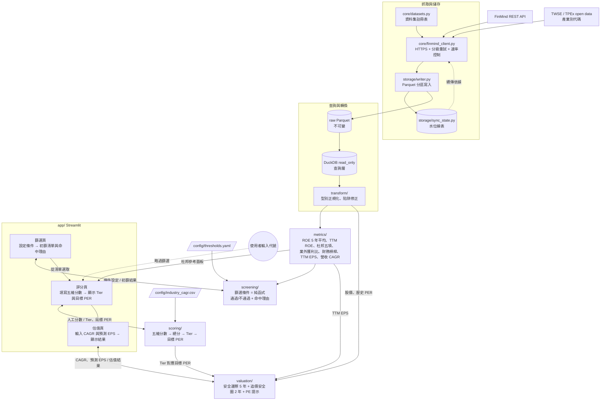

# 系統架構圖

依據規格書 §8（資料管線）與 §10（三個頁面）繪製。

```mermaid
graph TD
    A[FinMind REST API] --> C
    B[TWSE / TPEx open data<br/>產業別代碼] --> C

    subgraph "抓取與儲存"
        D[core/datasets.py<br/>資料集註冊表]
        C[core/finmind_client.py<br/>HTTPS + 分級重試 + 速率控制]
        E[storage/writer.py<br/>Parquet 分區寫入]

        F[(storage/sync_state.py<br/>水位線表)]
        D --> C
        C --> E
        E --> F
        F -. 續傳依據 .-> C
    end

    P[(raw Parquet<br/>不可變)]
    E --> P

    subgraph "查詢與轉換"
        G[(DuckDB read_only<br/>查詢層)]
        H[transform/<br/>型別正規化、陷阱修正]
        P --> G
        G --> H
    end

    I[metrics/<br/>ROE 5 年平均、TTM ROE、杜邦五項、<br/>業外獲利比、財務槓桿、<br/>TTM EPS、營收 CAGR]
    H --> I

    CFG1[/config/thresholds.yaml/]
    CFG2[/config/industry_cagr.csv/]

    J[screening/<br/>篩選條件 = 純函式<br/>通過/不通過 + 命中理由]
    S[scoring/<br/>五維分數 → 總分 → Tier → 目標 PER]
    V[valuation/<br/>安全邊際 5 年 + 追價安全圈 2 年 + PE 提示]

    I --> J
    CFG1 --> J
    CFG2 --> S
    S -->|Tier 對應目標 PER| V
    I -->|TTM EPS| V
    H -->|股價、歷史 PER| V

    subgraph "app/ Streamlit"
        K1["篩選頁<br/>設定條件 → 初篩清單與命中理由"]
        K2["評分頁<br/>填寫五維分數 → 顯示 Tier 與目標 PER"]
        K3["估值頁<br/>輸入 CAGR 與預測 EPS → 顯示結果"]
    end

    U((使用者輸入代號))

    K1 <-->|條件設定 / 初篩結果| J
    K1 -->|從清單選取| K2
    U -. 略過篩選 .-> K2
    K2 <-->|人工分數 / Tier、目標 PER| S
    K2 --> K3
    K3 <-->|CAGR、預測 EPS / 估值結果| V
    I -->|杜邦參考面板| K2

    %% 階段 3 後再加入（規格書 §10.2 尚未定稿）：
    %% S -.-> UI[(data/user_inputs.db<br/>人工輸入 append-only)]
    %% V -.-> UI
```